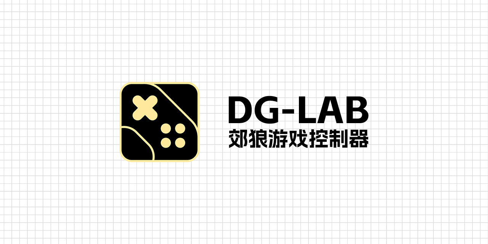

# 郊狼游戏控制器
一个希望将全部游戏郊狼化的控制器：让所有游戏都和郊狼 DG-Lab 一起发电吧！

**[下载 DG-Lab 游戏控制器](https://github.com/LYQBING/DG-Lab-Game-Controller/releases)**

**[前往 开发者文档](https://dg.lyqbing.top/Introduction/introduction)**

## ✨ 说在前面
DG-Lab-Game-Controller 是一个轻量的控制器框架，本身并不具备检测功能，而是为第三方插件提供统一的事件与设备通信。

第三方插件负责检测游戏或服务所触发的“惩罚事件”（例如击杀、失误、任务失败等），并将惩罚数据发送至控制器，由控制器负责将惩罚数据转发到已连接的物理设备或输出目标。

## ❓ 常见问题
**插件的安全性：** 任何第三方插件都有可能存在安全风险。在安装任何的第三方插件前，请确保其：
- 确保插件来源安全可靠并有明确的插件介绍
- 经过社区安全验证或推荐

**反作弊系统兼容性：** 由于不同游戏的反作弊策略各有差异，我们无法保证所有的插件都能在游戏中安全运行。因此我们建议：
- 务必确保其插件不会触发反作弊系统
- 查阅其插件开发者对其的描述
- 务必查看目标游戏的服务条款与规则，并评估风险。

**应用程序崩溃或功能异常：** 此类问题很有可能是您的安装路径或系统环境异常所致，请排查：
- 安装路径不能包含中文或特殊字符（若部分功能无法使用请排查此项）
- 请确保 .NET 框架已安装且版本符合要求（若程序无法启动请排查此项）
- 查看日志文件获取详细错误信息

**其他问题或反馈：** 看起来您遇到了麻烦？不必担心，让我们帮助您：
- 前往 [开发者文档](https://dg.lyqbing.top/Introduction/introduction) 以查阅完整的帮助文档
- 请通过 [GitHub Issue](https://github.com/LYQBING/DG-Lab-Game-Controller/issues) 反馈详细信息，包括系统环境、日志与复现步骤。

## 🔐 安全与隐私

- 官方代码审计：官方自带模块会在发布前进行基本安全检查。
- 第三方模块风险：任何第三方模块在本地执行代码时可能访问系统资源。安装前请确认来源与权限。
- 隐私说明：控制器不会主动上报用户设备信息至第三方服务（除非插件显式设计为上传）。发布插件时应在 README 中声明是否上传数据及其用途。

## 🙏 致谢
感谢所有 DG-Lab-Game-Controller 贡献者及第三方插件开发者

