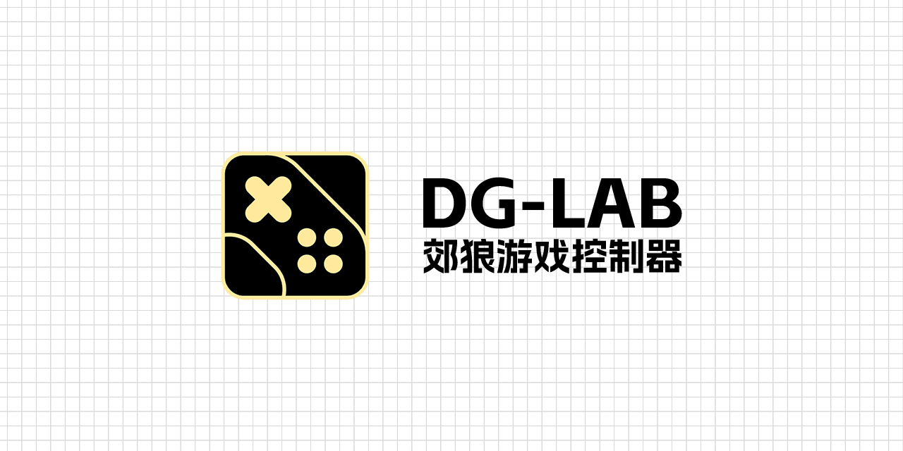

# DG-Lab 游戏控制器
一个希望将全部游戏郊狼化的控制器：让所有游戏都和郊狼 DG-Lab 一起发电吧！

**[下载 DG-Lab 游戏控制器](https://github.com/LYQBING/DG-Lab-Game-Controller/releases)**

**[前往开发者文档](https://)**

## 服务器参数介绍
**强度配置**
- 强度变化频率：强度变化的频率
- 基础强度：对您发送的惩罚数据 【根据模块发送的惩罚数据自动设置，您可以手动调节】
- 随机强度：对您发送的随机惩罚数据 【根据模块发送的惩罚数据自动设置，您可以手动调节】
- 一键开火强度限制：对您的开火惩罚上限 **【建议设置】**
- B 通道：是否开启 B 通道输出
- B 通道强度倍数：A通道强度 * 强度倍数
- 强度上限：蓝牙连接时显示，否则请在郊狼APP中设置 **【建议设置】**

**波形配置**
- 波形列表：设置您的惩罚波形 【根据模块发送的惩罚数据自动设置，您可以手动调节】

**游戏连接**
- 为支持 MOD 的游戏预留接口

## 程序参数介绍
**服务器模式**
- 使用内置服务器：启动后将使用内置的 [DG-Lab-Coyote-Game-Hub](https://github.com/hyperzlib/DG-Lab-Coyote-Game-Hub) 并支持图形化设置。

**服务器连接设置**
- 服务器地址：控制台的地址
- 服务器端口：控制台端口号
- 客户端标识：DG-LAB ID

**内置服务器设置**
- 监听地址：服务器在网络中监听特定的IP地址
- 波形文件路径：指定服务器内置的波形路径
- 广播所有客户端：是否向所有客户端进行通讯
- 显示终端管理器：是否显示服务器启动后的终端管理器
- 启动时打开控制台：在服务器启动后是否主动打开它的控制台

**客户端设置**
- 详细日志输出：开启后将会输出触发惩罚时的日志等信息
- 退出时最小化：开启后程序退出时进入最小化，可以防止误关闭程序及隐藏程序

## 关于模块开发
本程序是基于 [DG-Lab-Coyote-Game-Hub](https://github.com/hyperzlib/DG-Lab-Coyote-Game-Hub) 的 API 进行开发，因此可以根据您的不同需求进行开发：

**何时选择 DG-Lab-Coyote-Game-Hub**

它为您提供了网页 API 及控制器功能，若您不需要其他功能封装或统一管理模块时，您可以直接采用它进行开发。
适用场景建议：
- 您可以通过它为支持 MOD 功能的游戏开发 MOD。
- 您可以直接通过 URL 进行惩罚控制。

**何时选择 DG-Lab-Game-Controller**

它在原有功能之上，直接为您提供了 C# 的脚本代码，您可以直接通过代码控制郊狼进行惩罚。且支持统一的模块管理，您可以更加方便的处理用户所设置的参数。
适用场景建议：
- 您可以通过它对不支持 MOD 的游戏进行注入。
- 您可以使用它快速开发通用惩罚功能。

## 常见问题
**它的工作流程是什么？**

它将会根据你使用的不同模块触发不同的事件。随后将事件所产生的数据发送至控制台，由控制台向你的郊狼 DG-LAB 设备发送惩罚数据。

**模块是否安全?**

我们可以保证内置的模块安全可靠，但如果您安装了第三方的模块就可能出现问题！我们不能保证第三方模块是否会破坏您的设备...因此安装模块时请确保其安全可靠！我们对于您使用这些模块可能发生的任何问题，我们概不负责。

**我可以在具有反作弊的游戏中使用它吗？**

对于不同模块的不同性质，我们无法确保他们都安全可靠，因此我们在此不做任何回答。

对于内置的【手柄的震动天罚】：它不会修改游戏内的任何数据，因此注入和加载过程通常不会触发 VAC 封禁。 但是在部分游戏中可能会出现意料之外的风险，因此我们不建议向具有反作弊的游戏进行注入！

对于内置的【羽翼的色彩】：它不会获取游戏内任何的数据，它仅仅是实时获取您指定区域的颜色信息（类似录屏操作），因此使用此模块通常不会有任何风险。~~如果游戏连录屏都不允许的话，请当我没说！~~

综上所述：如果您想要在具有反作弊的游戏中使用内置或第三方的任何模块，请确保该游戏不会对这些行为进行封禁，并且对于您的游戏账号可能发生的任何问题，我们概不负责。

**为什么我的设备没有输出？**

请确保你已经开启了内置服务器或安装并启动了 [DG-Lab-Coyote-Game-Hub](https://github.com/hyperzlib/DG-Lab-Coyote-Game-Hub) ，请确保它正处于运行状态（已连接且保持输出中），随后检查它的服务器配置是否与控制台的服务器地址相匹配。

**它是否支持 DG-Lab-Coyote-Game-Hub 的功能？**

它支持所有 [DG-Lab-Coyote-Game-Hub](https://github.com/hyperzlib/DG-Lab-Coyote-Game-Hub) 的功能或程序。同时您无需考虑本程序内是否存在相关模块，它们会通过 API 调用对您发送惩罚数据。
