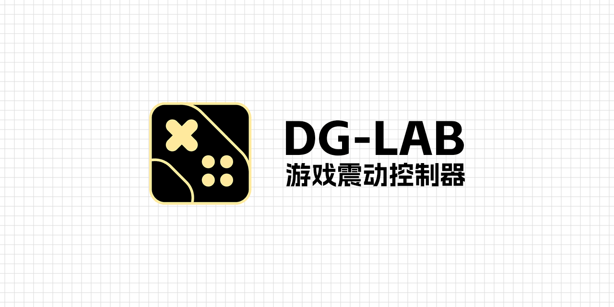

# DG-Lab 游戏控制器
允许郊狼 DG-Lab 通过游戏中手柄的震动数据进行输出：让你的游戏手柄和郊狼 DG-Lab 一起发电吧！
本项目由 [DG-Lab-Coyote-Game-Hub](https://github.com/hyperzlib/DG-Lab-Coyote-Game-Hub) 的 API 实现，因此你必须使用此控制台

**[下载 DG-Lab 游戏震动控制器](https://github.com/LYQBING/DG-Lab-Game-Vibration-Controller/releases)**

**[下载 DG-Lab 控制台](https://github.com/hyperzlib/DG-Lab-Coyote-Game-Hub/releases)**

## 说在前面
此项目原名为“DG-Lab-Game-Vibration-Controller”，现更名“DG-Lab-Game-Controller”，日后将会再次重构，将不仅包含手柄功能！

对于 部分设备及游戏 无法在理想状态下进行工作，当前项目支持：
- 使用 Windows XInput 的游戏（Xbox 控制器）

使用 [DG-Lab-Coyote-Game-Hub](https://github.com/hyperzlib/DG-Lab-Coyote-Game-Hub) 后的工作建议：

- 使用此控制台的蓝牙直连郊狼 DG-Lab 设备，则无需使用 DG-LAB 手机客户端
- 在游戏运行时请勿关闭此程序，以防出现意料之外的错误

## 使用教程
**1.安装所需的程序：** 首先你需要安装【游戏震动控制器】及【控制台】，这已经在介绍中为你提供了

**2.启动控制台及游戏震动控制器：** 通常情况下你只需要使用默认数据。当然，你可以在【控制台】中设置输出值及随机值等内容

**3.注入目标程序：** 在【游戏震动控制器】中的注入页中【刷新进程】后选择你想要的下程序并点击【注入】

**4.完成！** 理论上你已经可以开始享受游戏了，不过再此之前，还是建议你稍稍设置下程序？~~别被电死了，杂鱼~~

## 设置参数介绍
**服务器设置：** 通常，你并不需要设置这里的内容（除非你有特殊需求）
- 服务器地址：控制台的地址
- 服务器端口：控制台端口号
- 客户端标识：DG-LAB ID

**DG-LAB 设置：** 即使此处设置一万伏特，也是没有关系的（在控制台中设定输出上限值，默认为 20）
- 启用双频合一：开启后输出手柄双马达的平均值，关闭则输出两个之间的最大值（若无特殊需求，默认即可）
- 启用线性输出：将根据手柄的震动大小动态输出，关闭则直接输出指定值（若想要更沉浸的体验，请开启）
- 启用轻量模式：尽可能的减少对 DG-LAB 设备的请求（若延迟较大，请关闭）
- 基础输出值：向 DG-LAB 发送的最低电量值，即使当前手柄没有震动
- 输出的倍数：最终输出的结果将乘该值，越大电量越强（马达最大震动值为 1：若设置20，则最大输出20） 
- 控制器标值：程序返回的马达震动的最大值，用于计算线性输出的结果（通常保持默认即可，~~瞎填电死你~~）

**程序设置：** 程序内部的功能设计相关，按需开启即可
- 详细日志内容：开启后将会输出触发惩罚时的日志等信息
- 动态模块注入：开启后注入时将自动扫描目标程序的 Windows XInput 进程，关闭后则访问指定进程
- 退出时最小化：开启后程序退出时进入最小化，可以防止误关闭程序及隐藏程序
- 启用底部标签：开启后下次启动时在 Dock 栏中的图标按钮下方添加文本标签

## 常见问题
**它的工作流程是什么？**

当目标程序向你的手柄发送震动数据时，此程序将捕获震动数据，并根据你的设置加工这些数据，随后将 这些数据发送至控制台，由控制台向你的郊狼 DG-LAB 设备发送惩罚数据。

**它是否会修改数据？**

它不会对你的游戏进行任何修改，当它被注入指定程序后，它仅存在于该进程的生命周期。

**我可以在具有反作弊的游戏中使用它吗？**

不建议向具有反作弊的游戏进行注入！它不会修改任何数据，因此注入和加载过程通常不会触发 VAC 封禁。 但是在部分游戏中可能会出现意料之外的风险！如果你仍旧想要尝试进行注入， 请确保该游戏不会对此注入行为进行封禁，并且对于你的账号可能发生的任何事情，我们概不负责。

**为什么要采用 DG-Lab-Coyote-Game-Hub ？**

- 通过它可以使用蓝牙直连郊狼 DG-Lab 设备，延迟更小
- 会更好的统一管理惩罚数据，并可以设置最终的惩罚输出上限，因此你不必担心惩罚数据的异常
- 快捷的设置相关输出属性，无需繁琐的设置
- ~~我懒得做~~

**为什么它关闭后游戏就崩溃了？**

当它对目标程序完成注入后，目标程序发送手柄震动数据时，则会同时向它发送数据，但此时若它被关闭了， 程序间的通信通道不存在，自然就崩溃了。

在此特别建议：当注入完成后，在你存档游戏或关闭游戏前，请勿关闭此程序及控制台(关闭控制台一般不会出现问题， 但仍旧不推荐)，以防出现意料之外的错误。

**为什么我的设备没有输出？**

请确保你已经安装并启动了 DG-Lab-Coyote-Game-Hub 确保它正处于运行状态（已连接且保持输出中），随后检查它的服务器配置是否与控制台的服务器地址相匹配。 当然，若你的游戏没有适配手柄或你没有使用手柄进行控制，则无法捕获震动数值。

**为什么我注入失败了？**

- 游戏不是采用 Windows XInput 输出的，对于这类游戏暂时还没有解决办法
- 可能是你的设备不能使用动态注入的 DLL（极少数设备，此项可能性不大）

**我不能使用/不想使用动态注入的DLL？**

使用动态注入理论上将适配更多应用程序，且稳定性更好。若您并非设备原因则不建议您关闭动态注入！若您已经决定了关闭此项功能，请前往【设置】页面关闭【动态模块注入】
